# Инструкция по установке необходимого ПО для работы с теоретической частью
Эта инструкция рассказывает об установке ПО, необходимого для работы с математическими моделями и синтезом регуляторов c помощью библиотеки Control System Toolbox на Python.

## Windows
1. **Установите среду разработки VSCode**
   Следуйте инструкции по установке <https://code.visualstudio.com/docs/setup/windows>
1. **Обновите Python до последней версии:**
   - Перейдите по ссылке <https://www.python.org/downloads/> и скачайте самую последнюю версию Python.
   - Запустите скачанный файл от имени администратора и следуйте инструкциям мастера установки.
1. **Установите Miniconda:**
   - Перейдите по ссылке <https://www.anaconda.com/download/success> и выберите для скачивания *Miniconda Installer*
   - Запустите мастер установки и следуйте инструкциям на экране. Когда вы дойдете до страницы *Advance Installation Options* отметьте все предлагаемые пункты галочками, не смотря на возможное появление предупреждений.

      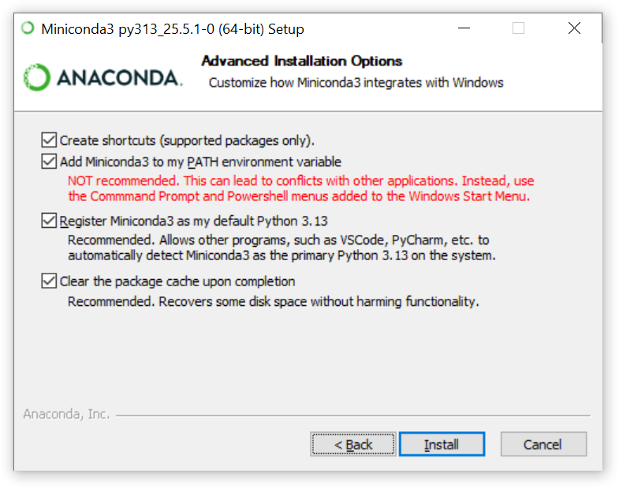

   - Нажмите кнопку *Install* и дождитесь окончания установки.
1. **Установите необходимые Python-библиотеки** 
   Откройте терминал Anaconda Prompt и установите все необходимые библиотеки:
   ```conda install -c conda-forge slycot
   conda install numpy
   conda install matplotlib
   conda install -c conda-forge scipy
   conda install -c conda-forge control```
1. **Скачайте репозиторий:**
 <https://github.com/voltbro/ReactionWheel> 
1. **Откройте репозиторий в VSCode:**
Откройте VSCode, нажмите *File → Open Folder* и выберите папку со скачанным репозиторием.
1. **Убедитесь в правильности установки:**
   - Откройте файл *Python → test.ipynb*
   - Нажмите *Select Kernel* в правой верхней части окна и выберите *Select Another Kernel → Python Environments → base (Python 3.13.2)*
   - Нажмите кнопку *Run All*. Если при выполнении снизу отобразился график переходного процесса, то вы всё сделали правильно.

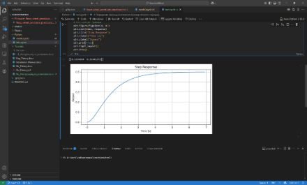

## Ubuntu
1. **Установите VSCode:**

   ```sudo snap install --classic code```

1. **Установите pip:**

   ```sudo apt install python3-pip```

1. **Установите все необходимые библиотеки**

   ```pip install numpy matplotlib scipy slycot control```

1. **Скачайте репозиторий**
 <https://github.com/voltbro/ReactionWheel> 
1. **Откройте репозиторий в VSCode**
   Откройте VSCode, нажмите *File → Open Folder* и выберите папку со скачанным репозиторием.
1. **Убедитесь в правильности установки:**
   - Откройте файл *Python → test.ipynb*
   - Нажмите *Select Kernel* в правой верхней части окна и выберите *Select Another Kernel → Python Environments → base (Python 3.13.2)*
   - Нажмите кнопку *Run All*. Если при выполнении снизу отобразился график переходного процесса, то вы всё сделали правильно.


# Инструкция по установке ПО для работы с аппаратной частью
Эта инструкция рассказывает об установке ПО, необходимого для программирования микроконтроллера, управляющего обратным маятником.
1. **Установите Arduino IDE**
   - Перейдите по ссылке <https://www.arduino.cc/en/software>.
   - Скачайте файл установки *Arduino IDE 2.3.4* для *Windows 64 bit*.
   - На своем компьютере перейдите в папку, куда вы скачали файл установки и запустите его.
   - При запуске появится окно установщика. Прочитайте лицензионное соглашение и нажмите кнопку Принимаю, если вы с ним согласны:

   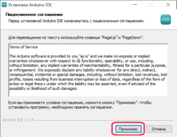

   - Выберите пункт *Только для меня*, а затем *Далее*:

   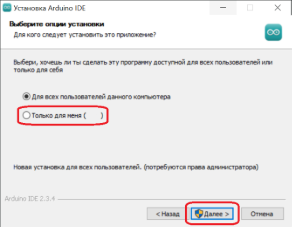

   - Если вы не хотите устанавливать программу по адресу, указанному по умолчанию, нажмите кнопку *Обзор* и выберите новый адрес. Затем нажмите кнопку *Установить*:

   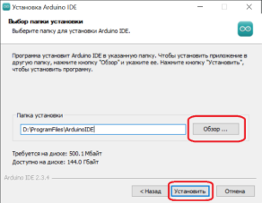

   - Дождитесь завершения установки:

   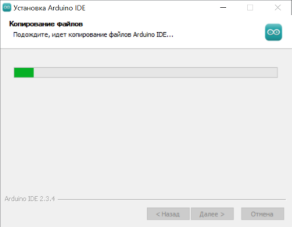

   - Снимите галочку *Запустить Arduino IDE* и нажмите кнопку *Готово*:

   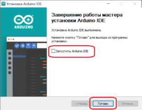
1. **Установите STM32CubeProg**
   Для прошивки модулей требуется программатор. Чтобы Arduino IDE смогла с ним работать, нам понадобится утилита STM32CubeProg. Это универсальная программа, содержащая всё необходимое для прошивки микроконтроллеров STM32. Она позволяет прошивать их, используя различные интерфейсы. Чтобы установить её проделайте следующие операции:

   - Перейдите по ссылке <https://www.st.com/en/development-tools/stm32cubeprog.html>.
   - Скачайте себе на компьютер установочный файл *STM32CubeProgrammer 2.19.0* для *Windows 64 bit*.
   - На своем компьютере перейдите в папку, куда вы скачали файл установки.
   - Запустите файл установки.
   - Программа требует права администратора. При запуске вы можете увидеть окно *Разрешить приложению вносить изменения на вашем устройстве?*. Согласитесь, нажав кнопку *Да*.
   - В открывшемся окне мастера установки нажмите кнопку *Next*:

      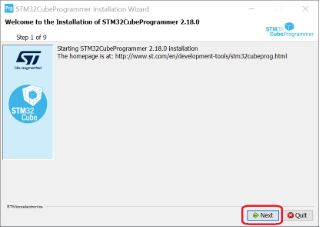

   - Ознакомьтесь с содержимой информацией по установке и нажмите *Next*:

      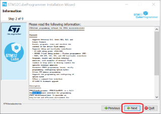

   - Ознакомьтесь с лицензионным соглашением и, если вы с ним согласны, то выберите пункт *I accept the terms of this license agreement*, затем нажмите *Next*:

      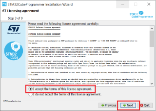

   - Выберите адрес установки нажатием кнопки *Browse* и затем снова *Next*:

      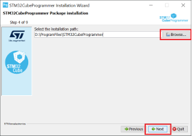

   - Если такой папки не существует, то появится окно:

      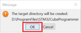

      Согласитесь, нажав *OK*

   - Поставьте галочку рядом с пунктом *I have read and understand…* и затем *Next*:

      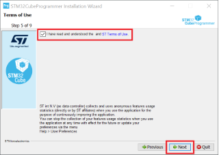

   - Убедитесь, что выделены все пункты и нажмите *Next*:

      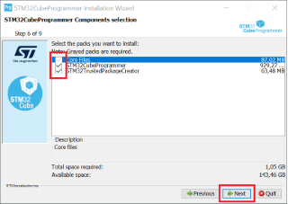

   - Начнется установка пакета. В процессе установки появится мастер установки драйверов устройств:

      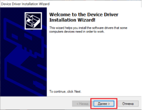 

      Нажмите *Далее → Установить*. После завершения установки драйвера, нажмите кнопку *Готово*.

   - Когда установка STM32CubeProg завершится, нажмите *Next*:

      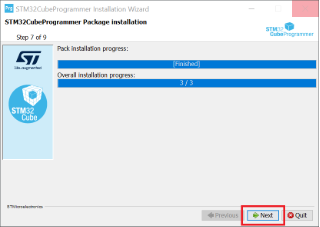

   - Снимите галочки напротив всех пунктов и нажмите *Next*:

      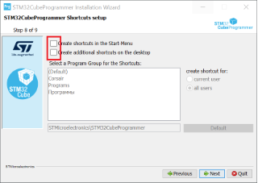

   - Нажмите кнопку *Done*, чтобы завершить установку:

      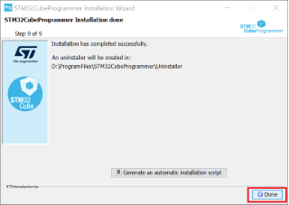

1. **Установите библиотеку STM32duino**
   Ключом к взаимодействию *Arduino IDE* и микроконтроллеров семейства STM32 является библиотека *STM32duino*. Для ее установки в *Arduino IDE* сделайте следующее:

   - Откройте среду разработки *Arduino IDE*, перейдите в меню *File -> Preferences*. 

      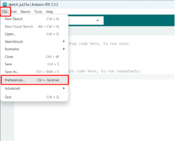

   - В области текстового поля *Additional Boards Manager URLs* вам нужно добавить URL пакета поддержки аппаратных средств *STM32DUINO*. Если у вас уже есть другие URL-адреса пакетов поддержки плат, просто добавьте новый через запятую. Ссылка, которую нужно вставить: 

      https://github.com/stm32duino/BoardManagerFiles/raw/main/package\_stmicroelectronics\_index.json

   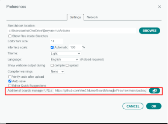

   - Нажмите кнопку *ОК*.
   - В главном окне программы выберите меню *Инструменты (Tools) → Плата (Board) → Менеджер плат (Boards manager)*. В появившемся окне впишите в поле поиска *STM32*, должен появиться пакет *STM32 MCU based boards*. Нажмите кнопку *Установить*. По окончании установки закройте окно менеджера плат.

1. **Настройте Arduino IDE**
   Теперь приступим к настройке Arduino IDE для работы с микроконтроллерами STM32. Модуль VBCoreG4 основан на микроконтроллере STM32G474RExx. Выставим правильные настройки для него. Для начала работы в разделе *Инструменты (Tools)* необходимо выставить следующие настройки:

   - Укажите серию платы. Для этого выберите пункт меню *Tools -> Board -> STM32 MCU based boards -> GenericSTM32G4 series*.

      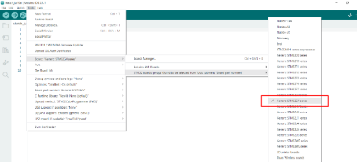

   - Убедитесь, что эта же модель у вас отображается в списке плат, на которую вы собираетесь устанавливать прошивку.

      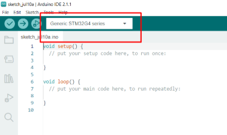

   - Если в списке плат вы не нашли нужную вам, то кликните на стрелку внизу и выберите *Select Other Board and Port*. Укажите необходимые названия и нажмите *OK*.

      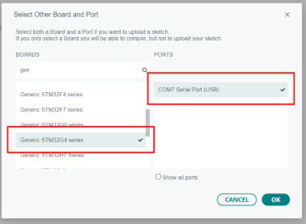

   - Выберите обозначение платы: *Tools → Board part number → Generic G474RETx*

      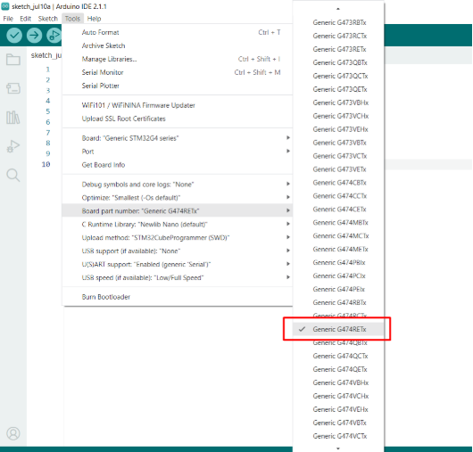

   - Укажите метод загрузки: *Tools → Upload method → STM32CubeProgrammer (SWD)*

      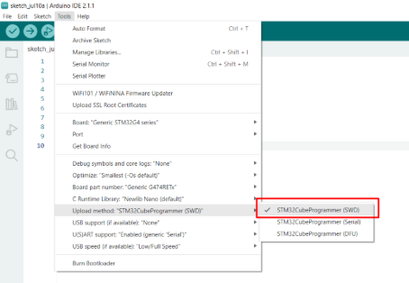

   - Для того, чтобы программы, написанные под Arduino IDE, корректно работали на плате VBCore VB32G4, нужно установить библиотеку VBCoreG4\_arduino\_system, в которой собраны функции настройки частот, инициализации CAN и конфигурации некоторых других параметров. Скачать её можно по ссылке https://github.com/VBCores/VBCoreG4\_arduino\_system. Скопируйте папку VBCoreG4\_arduino\_system в директорию, где хранятся библиотеки для Arduino. Чаще всего эта директория имеет адрес C:\Program Files (x86)\Arduino\libraries или C:\Users\username\Documents\Arduino\libraries, однако у вас место положение библиотек может отличаться. 

   |![ref1]|
   | :- |
   |Если вы не уверены, где именно хранятся библиотеки, то в Arduino IDE откройте *File  →  Preferences*.  В поле *Sketchbook location* будет указан адреc, где как-раз находится папка *libraries*.|

1. **Установите библиотеки для работы с кодом:**

   - Воспользуйтесь инструкцией для установки библиотеки SimplFOC, управляющей бесколлекторными двигателя <https://docs.simplefoc.com/library_download>
   - Установите библиотеку для работы с датчиками AS5600:
      - Перейдите на страницу <https://github.com/Seeed-Studio/Seeed_Arduino_AS5600> и скачайте репозиторий ZIP-архивом
      - В Arduino IDE выберите *Sketch → Include Library → Add .ZIP Library*.
      - В открывшемся окне выберите скачанный zip-архив и нажмите *Открыть*.

Поздравляем! Вы успешно установили и настроили все инструменты для работы с обратным маятником!


[ref1]: Aspose.Words.1cc374a5-84bc-4e77-9cff-f06863e60d99.020.png
