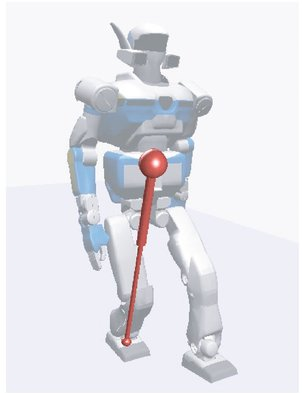

# Введение

Существуют объекты, у которых при отсутствии управления желаемый режим работы неустойчив. К подобным объектам можно отнести летательные аппараты, у которых центр давления расположен впереди центра масс. Такие летательные аппараты обладают высокой маневренностью, но при этом являются статически неустойчивыми. Для обеспечения устойчивости используется система управления. 

Значительные трудности обычно вызывает задача построения управления объектами, в которых число управляющих воздействий меньше числа степеней свободы. В этом случае говорят, что это *объект с дефицитом управляющих воздействий*. В англоязычной литературе такой объект управления называют under-actuated object. К таким объектам можно отнести летательные аппараты, большинство автомобилей и обратные маятники [1]. 

Обратный маятник — это маятник, центр масс которого расположен выше его точки опоры, как правило на конце жёсткого стержня. В то время как обычный маятник устойчиво висит вниз, обратный маятник по своей природе неустойчив и должен постоянно балансироваться чтобы оставаться в вертикальном положении, с помощью системы управления. Существует несколько разновидностей обратных маятников. Рассмотрим некоторые из них.

<!--  -->

<figure>
    
    <!-- <figcaption> </figcaption> -->
</figure>

***Рисунок 1.*** *Маятник на подвижной тележке.*

Классическим примером является маятник на подвижной тележке (рис. 1).  Задача состоит в том, чтобы, перемещая тележку вдоль продольной оси, обеспечить установленному на неё стержню устойчивое равновесие. Всем известно, что, перемещая ладонь руки в горизонтальной плоскости, можно удерживать от падения стоящую на ней вертикальную палку. Особенно легко это делать, если палка длинная и её масса сосредоточена на верхнем конце. Имеются также вариации с двумя, тремя и более звеньями (рис. 2). 

<figure>
    
</figure>

***Рисунок 2.*** *Двухзвенный обратный маятник на линейной подвижной платформе.*

Другая модель – маятник Фуруты. Здесь устойчивое равновесие обеспечивается путем вращательного движения подвижного основания (рис. 3). 

<figure>
    
</figure>

***Рисунок 3.*** *Маятник Фуруты.*

<figure>
    
</figure>

***Рисунок 4.*** *Обратный маятник с маховиком.*

Существуют маятники, у которых основание неподвижно, а управление осуществляется благодаря установленному на конце стержня маховику, приводимому в движение с помощью электродвигателя (рис. 4). Движение такого маятника осуществляется в одной плоскости. Но подобный принцип можно использовать для удержания баланса в нескольких плоскостях. Например, для удержания равновесия подвижного стержня или куба (рис. 4 и 5). Причем такой куб может не только удерживать равновесие, но и перемещаться в пространстве.

<figure>
    
</figure>

***Рисунок 5.*** *Балансирующий стержень.*

<figure>
    
</figure>

***Рисунок 6.*** *Балансирующий куб.*

Для наглядности, ниже приведен список ссылок на видеозаписи с демонстрацией работы описанных маятников:

- линейный обратный маятник <https://youtu.be/XWhGjxdug0o?si=kb5AgjxUWUN_GxET> 
- линейный обратный маятник с тремя звеньями <https://youtu.be/meMWfva-Jio?si=fBdEp7RY7XR0lKqa> 
- маятник Фуруты <https://youtu.be/XKzzWe15DEw?si=PdX9CbOycCJdFVeJ>
- обратный маятник с маховиком <https://youtu.be/FLvGr2hywII> 
- балансирующий стержень <https://youtu.be/woCdjbsjbPg?si=-d7IMDe7-9cZdVsS>
- балансирующий куб <https://youtu.be/n_6p-1J551Y?si=TcxH2565jX23d_Uw>

Хотя обратный маятник широко используется в качестве тестового объекта при изучении теории управления, его принципы лежат в основе многих практических устройств. Например, ориентация искусственных спутников земли производится с помощью маховиков, установленных внутри корпуса. Обратные маятники находят применение в таких транспортных средствах, как сегвей, моноколесо и гироскутер. Даже процесс ходьбы можно выразить через модель обратного маятника [2]. При двуногой ходьбе представьте, что стопа опорной ноги является основанием маятника, а корпус – положением центра масс стержня (рис. 7).

<figure>
    
</figure>

***Рисунок 7.*** *Модель трехмерного линейного обратного маятника, используемая в системе управления ходьбы двуногого шагающего робота.*

Целью этой практической работы является построение алгоритмов управления маятником с маховиком. Реализуемые желаемые режимы движения – это раскачивание маятника с переводом его в верхнее неустойчивое положение равновесия и его стабилизация в этом положении. Законы изменения управляющего воздействия, при которые реализуется желаемое движение, синтезируются в виде обратной связи.

При выполнении этой работы, предполагается, что вы уже установили и настроили всё необходимое ПО по инструкции из файла *Tutorials/Ru\_Инструкция\_по\_установке.docx*. Также предполагается, что вы уже обладаете базовыми знаниями в теоретической механике и теории автоматического управления. Если у вас возникнут сложности с пониманием материала, обратитесь к учебникам [3] и [5]. Также необходимы навыки работы с Arduino IDE при выполнении практической части работы.
## Устройство маятника с маховиком
На рис. 8 показан однозвенный маятник 4 с маховиком 1. Маятник способен совершать круговые движения в вертикальной плоскости. Его ось вращения 5 расположена на неподвижном основании. В этой оси отсутствует какой-либо привод. Сам маятник 4 также часто называют стержнем.

<!--  -->
<figure>
    
</figure>

***Рисунок 8.*** *Основные компоненты маятника с маховиком. 1 – маховик, 2 – электродвигатель, 3 – ось маховика, 4 – стержень, 5 – ось стержня, 6 – плата управления.*

Ось вращения маховика 3 закреплена на стержне и параллельна его оси вращения. Маховик приводится во вращение бесколлекторным электродвигателем 2. Электропривод, как и маховик, смонтирован на стержне. Статор двигателя жестко закреплен на стержне, ось ротора жестко соединена с осью маховика. Плата управления 6 содержит микроконтроллер, драйвер двигателя и трехфазный усилитель мощности. При управлении используется информация об углах поворота стержня относительно неподвижного основания и маховика относительно стержня. Эти углы измеряются магнитными датчиками углового положения, которые подключены к плате.
# Теоретическая часть
## Динамика маятника с маховиком
На рис. 9 приведена схема маятника. Стержень OB в точке O шарнирно соединён с неподвижной опорой. Ось шарнира перпендикулярна плоскости качания маятника. Симметричный относительно своей оси вращения маховик смонтирован на маятнике так, что его центр расположен на конце стержня в точке B. Маховик может поворачиваться в ту или иную сторону вокруг проходящей через точку B горизонтальной оси, перпендикулярной плоскости качания стержня. Эта ось параллельна оси шарнира О. Ось вращения маховика является продолжением оси ротора электродвигателя. Все необходимые обозначения и параметры маятника приведены в таблице 1. Cистема имеет две степени свободы. Единственное, с помощью чего можно управлять системой – это момент, вырабатываемый электродвигателем. 	

Вращение двигателем осуществляется с помощью алгоритма векторного управления. Мы будем подавать на вход управления двигателем желаемое напряжение (т.н. квадратурное напряжение в терминах векторного управления), тем самым имитируя поведение коллекторного двигателя. Соответственно, управляющим параметром для системы управления маятником тоже будет напряжение. Чтобы преобразовать желаемый момент в напряжение, в модель маятника нужно будет дополнительно включить модель коллекторного двигателя.

<!--  -->
<figure>
    
</figure>

***Рисунок 9.*** *Схематичное изображение обратного маятника с маховиком.*

***Таблица 1.*** *Параметры маятника.*

|Параметр|Ед. изм.|Описание|
| :- | :- | :- |
|$L_1$|м|Расстояние от точки О до центра масс стержня|
|$L_2$|м|Расстояние от точки О до маховика|
|$m_1$|кг|Масса стержня|
|$m_2$|кг|Масса маховика|
|$\theta$|рад|Угол поворота стержня|
|$\phi$|рад|Угол поворота маховика|
|$I_1$|кг/м2|Момент инерции стержня|
|$I_2$|кг/м2|Момент инерции маховика|
|$g$|м/с2 |Ускорение свободного падения|
|$\tau$|Н м|Момент, вырабатываемый электродвигателем|
|$\mu_p$|-|Коэффициент вязкого трения в шарнире *О*|
|$\mu_m$|-|Коэффициент вязкого трения между статором и ротором двигателя|

Динамическую модель будем строить при помощи метода Лагранжа. Он является одним из классических подходов к получению уравнений движения механических систем с помощью уравнений Лагранжа второго рода. В отличие от второго закона Ньютона, метод Лагранжа оперирует энергетическими величинами: кинетической и потенциальной энергией.

Суть метода заключается в следующем: для системы с n обобщёнными координатами $η_1$, $η_2$, …, $η_n$​ строится так называемый **лагранжиан** $L=T-U$, где $T$— кинетическая энергия, $U$ – потенциальная энергия системы. Далее, для каждой координаты $η_i$​ записывается уравнение Лагранжа второго рода:

$\frac{d}{dt}\left(\frac{\partial L}{\partial{\dot{\eta}}_i}\right)-\frac{\partial L}{\partial\eta_i}=\mathcal{Q}_i$

где $Q_i$​ – обобщённая сила.

Подробно изучить принципы построения динамических уравнений можно в книге [3]. Напомним общий алгоритм построения модели методом Лагранжа:

1. Выбрать обобщённые координаты – минимальный набор независимых переменных, полностью описывающих положение системы.
1. Найти обобщенные силы
1. Вычислить кинетическую энергию $T$, как сумму энергий всех подвижных масс, включая вращательное движение.
1. Вычислить потенциальную энергию $U$, которая обычно зависит от положения в поле тяжести.
1. Построить лагранжиан $L=T-U$.
1. Применить уравнения Лагранжа второго рода для получения системы дифференциальных уравнений с учетом обобщённых сил Qi​ при наличии внешнего управления или трения.

Преимущества метода Лагранжа:

- Позволяет удобно описывать системы с несколькими степенями свободы и сложной кинематикой.
- Унифицированный подход как для поступательного, так и для вращательного движения.

Недостатки:

- Метод может стать громоздким для систем с большим числом степеней свободы.
- Требует символьных вычислений, что часто затрудняет его реализацию вручную.

Метод Лагранжа является мощным инструментом для моделирования динамики, особенно в задачах, где важны энергетические соотношения и наличие связей между телами.

После построения системы нелинейных дифференциальных уравнений методом Лагранжа, нам будет нужно линеаризовать её, затем представить в пространстве состояний, и наконец перевести дискретную форму. Это вызвано тем, что анализ и синтез управления проще производить, когда динамика системы описана именно в такой форме.

Приступим к построению динамической модели маятника в соответствие с предложенным выше алгоритмом. Сначала в качестве обобщенных координат возьмем $θ$ и $ϕ$. С их помощью мы можем полностью описать положение системы. 

На систему действуют три силы: сила вязкого трения $\mu_p\dot{\theta}$ в неподвижной точке крепления стержня *O*, сила вязкого трения $\mu_m\dot{\phi}$ между статором и ротором двигателя и крутящий момент $τ$, создаваемый электродвигателем. Таким образом вектор обобщенных сил будет выглядеть как:

$\mathbf{Q} = \begin{bmatrix} -\mu_p \dot{\theta} & \tau - \mu_m \dot{\phi} \end{bmatrix}^\top$

Теперь вычислим общую кинетическую энергию маятника путем сложения кинетических энергий каждого звена по формуле:

$T=\sum_{i=1}^{2}T_i,$

где $T_i=\frac{1}{2}m_i{\dot{x}}_i^2+\frac{1}{2}m_i{\dot{y}}_i^2+\frac{1}{2}I_i{\dot{\alpha}}_i^2$ – формула кинетической энергии в общем виде, $m_i$ – масса $i$-го звена, $I_i$ – момент инерции $i$-го звена, $x_i$ и $y_i$ – положение центра масс $i$-го звена вдоль осей $X$ и $Y$ соответственно, $α_i$ – угол поворота $i$-го звена. В нашем случае $x_i$, $y_i$, $α_i$:

$$
x_1 = L_1 \cos \theta ;\quad y_1 = L_1 \sin \theta ;\quad \alpha_1 = \theta \tag{1}
$$

$$
x_2 = L_2 \cos \theta;\quad   y_2 = L_2 \sin \theta;\quad   \alpha_2 = \phi.
\tag{2}
$$

Их производные по времени примут следующий вид:

$$
x_1 = -L_1 \dot{\theta} \sin \theta;\quad   y_1 = L_1 \dot{\theta} \cos \theta;\quad   \alpha_1 = \dot{\theta};
\tag{3}
$$

$$
x_2 = -L_2 \dot{\theta} \sin \theta;\quad   y_2 = L_2 \dot{\theta} \cos \theta;   \alpha_2 = \dot{\theta} + \dot{\phi}.
\tag{4}
$$

\( x_2 = -L_2 \dot{\theta} \sin \theta;\quad y_2 = L_2 \dot{\theta} \cos \theta;\quad \alpha_2 = \dot{\theta} + \dot{\phi} \)

Выражение $α_2 = \dot{θ} + \dot{ϕ}$ получено согласно *теореме о сложении скоростей*, которая звучит так:

>**Теорема о сложении скоростей**
Абсолютная скорость точки равна векторной сумме её переносной и относительной скоростей:
$$
v_a = v_e + v_r,
$$
где $v_a$ – вектор абсолютной скорости, $v_e$ – вектор переносной скорости, $v_r$ – вектор относительной скорости.

В нашем случае маховик вращается относительно стержня, следовательно угловая скорость равна $\dot{θ} + \dot{ϕ}$. Более подробно о сложном движении точки в пространстве можно почитать в [3](#список-литературы).

Построим уравнение кинетической энергии маятника, подставив в него полученные переменные (3-4):

T=12m1L12θ2sin2θ+m1L12θ2cos2θ+I1θ2+m2L22θ2sin2θ+m2L22θ2cos2θ+I2θ+ϕ2.

Упростив выражение, получим:

T=12m1L12+m2L22+I1+I2θ2+I2θϕ+12I2ϕ2.#5

Аналогично, потенциальная энергия маятника равна сумме потенциальных энергий стержня и маховика:

U=m1gy1+m2gy2.

Подставим сюда выражения (1-2):

U=m1L1+m2L2gcosθ.#6

Для простоты дальнейших вычислений произведем замену переменных. Пусть a=m1L12+m2L22+I1 и b=m1L1+m2L2g. Тогда уравнения (5) и (6) примут вид:

T=12(a+I2)θ2+I2θϕ+12I2ϕ2

U=bcosθ.

Теперь построим Лагранжиан:

L=T-U=12a+I2θ2+I2θϕ+12I2ϕ2-bcosθ.#7

Запишем уравнения Лагранжа второго рода с учетом обобщенных координат θ, ϕ и вектора обобщенных сил Q: 

ddt∂L∂θ-∂L∂θ=-μpθddt∂L∂ϕ-∂L∂ϕ=τ-μmϕ#8

Найдем все необходимые производные лагранжиана (7):

∂L∂θ=bsinθ;     ∂L∂θ=a+I2θ+I2ϕ;     ddt∂L∂θ=a+I2θ +I2ϕ;

∂L∂ϕ=0;               ∂L∂ϕ=I2θ+I2ϕ;                ddt∂L∂ϕ=I2θ+I2ϕ.

Подставим эти выражения в систему (8):

a+I2θ +I2ϕ-bsinθ=-μpθI2θ+I2ϕ=τ-μmϕ.

Преобразуем уравнения так, чтобы θ и ϕ лежали в левой части:

θ=-μpaθ+μmaϕ+basinθ-1aτϕ=-μmI2ϕ+μpaθ-μmaϕ-basinθ+1I2+1aτ.#9

Приведенная система дифференциальных уравнений описывает динамику механической части обратного маятника. Как было сказано в начале раздела, сконвертируем прилагаемый двигателем момент в напряжение. Таким образом система управления будет рассматривать текущий двигатель как коллекторный и использовать напряжение в качестве управляющего воздействия. 

Соотношение между напряжением и моментом выходного вала двигателя без редуктора и без учета трения описывается с помощью уравнений:

V=Lmdidt+Rmi+Keϕ,

τ=Kti.

Все параметры и переменные приведены в таблице 2. Подробнее, о том, как получить эти уравнения можно почитать в учебнике [4].

Таблица 2. Параметры электродвигателя.

|Параметр или переменная|Ед. измерения|Описание|
| :- | :- | :- |
|V|В|Подаваемое на двигатель напряжение|
|i|А|Ток, проходящий через обмотки двигателя|
|Lm|Гн|Индуктивность обмотки двигателя|
|Rm|Ом|Сопротивление обмотки двигателя|
|Ke|рад/с/В|Скоростная постоянная|
|Kt|Н м/А|Моментная постоянная|

Параметры Lm, Rm,Ke,Kt обычно указываются в документации на двигатель, либо находятся экспериментально. Индуктивность обмоток, как правило, намного ниже сопротивления, соответственно мы можем пренебречь переменной Lm. Тогда соотношение между моментом на валу и током можно выразить как:

τ=KtV-KeϕRm.

Подставим это выражение в систему (9):

θ=basinθ-μpaθ+Rmμm+KtKeaRmϕ-KtaRmVϕ=-basinθ+μpaθ-a+I2aI2μm+KtKeRmϕ-Kta+I2aI2RmV.#10

Мы получили математическую модель, полностью описывающую поведение обратного маятника. Теперь для синтеза управления и анализа на устойчивость нам необходимо её линеаризовать и привести к форме в пространствах состояния.

Линеаризуем систему (10) в окрестности точки θ=0. Тогда sinθ=θ, и система примет вид:

θ=baθ-μpaθ+Rmμm+KtKeaRmϕ-KtaRmVϕ=-baθ+μpaθ-a+I2aI2μm+KtKeRmϕ-Kt(a+I2)aI2RmV.

Представим теперь эту систему в пространстве состояний матричным уравнением:

x=Ax+Bu.#11

В качестве вектора состояния выберем x=θθϕT, а в качестве управляющего воздействия возьмем u=V. Само уравнение примет вид:

θθϕ=010ba-μpaRmμm+KtKeaRm-baμpa-a+I2aI2μm+KtKeRmθθϕ+0-KtaRm-Kta+I2aI2RmV#12

Теперь переведем уравнение (12) в дискретную форму. Существует множество методов преобразования непрерывных систем в дискретны. Мы рассмотрим метод Эйлера. От других он отличается простотой, но при этом обладает меньшей точностью при высоких значениях шага дискретизации. Чтобы метод был достаточно точным, шаг должен быть порядка 1 мс. 

Представим x в виде:

x=xk+1-xk∆t,

где ∆t - шаг дискретизации, xk – состояние системы на шаге k.

Подставим это выражение в уравнение (11):

xk+1-xk∆t=Axk+Buk.

Умножим уравнение на ∆t и перенесем xk в правую часть:

xk+1=xk+Axk∆t+Buk∆t.

Это уравнение можно представить в виде:

xk+1=Adxk+Bduk#13

где матрицы Ad и Bd описывают динамику системы и определяются как:

Ad=In+A∆t,#14

Bd=B∆t,#15

где In – единичная матрица размером n×n. В итоге уравнение (12) будет выглядеть следующим образом:

θk+1θk+1ϕk+1=1∆t0ba∆t1-μpa∆tRmμm+KtKeaRm∆t-ba∆tμpa∆t1-a+I2aI2μm+KtKeRm∆tθkθkϕk+0-KtaRm∆t-Kta+I2aI2Rm∆tVk#16

## Стабилизация маятника в верхнем неустойчивом положении равновесия
Рассмотрим задачу стабилизации маятника в верхнем неустойчивом положении равновесия θ=0, θ=0 в предположении, что в начале процесса стабилизации он уже находится в некоторой окрестности этого желаемого положения. Эта задача может быть решена с помощью регулятора полного состояния. Структурная схема такой системы управления показана на рисунке 9, где K – матрица весовых коэффициентов. Отметим, что в системе в качестве обратной связи используется весь вектор состояния и управляющее воздействие выглядит как:

uk=-Kxk#17

При этом задача сводится к выбору таких коэффициентов обратной связи матрицы K, чтобы система обеспечивала устойчивое вертикальное положение маятника.

Рисунок 9. Структурная схема системы управления с регулятором полного состояния.

`	`Существует множество способов выбора коэффициентов обратной связи, или, по-другому, *синтеза* управления. В текущей работе мы рассмотрим вариант решения задачи линейно-квадратичного управления. Далее по тексту, регулятор, синтезированный с помощью решения этой задачи, будем называть LQR от английского Linear Quadratic Regulator. 

*LQR* – это один из видов оптимальных регуляторов, использующий квадратичный функционал качества, который необходимо минимизировать:

J=0∞xTQx+uTRu∆t,

где Q** и** R∈Rn×n** – заданные положительно определенные матрицы весовых коэффициентов. Чем больше элементы матрицы Q, тем быстрее система будет стараться уменьшить ошибку управления, а чем больше элементы R – тем плавнее будет поведение системы. И наоборот, чем элементы Q меньше, тем больше статическая ошибка, и чем меньше элементы R, тем агрессивнее будет управление. Таким образом, функционал качества выражает компромисс между отклонением от нуля и затратами на управление. Подбор весовых коэффициентов осуществляется по следующим принципам:

- начинать нужно с диагональных единичных матриц:

  Q=diagq1,q2,…,qn,   R=diagr1, r2,…,rn.

- значения qi увеличивают наказание за отклонение соответствующего состояния xi от нуля.
- значения ri увеличивают штраф за управление ui, приводя к более плавному управлению.

В нашем случае используется дискретная система (16). Функционал качества для дискретный систем имеет вид:

J=k=0∞xkTQxk+ukTRuk∆t.

Закон управления по отрицательной обратной связи (17) должен минимизировать этот функционал. Согласно утверждению из [5] матрица K вычисляется как:

K=R+BdTPBd-1BdTPAd,#18

где P – положительно определенная матрица, являющаяся решением дискретного алгебраического уравнения Риккати:

P=AdTPAd-AdTPBdR+BdTPBd-1BdTPAd+Q

Это уравнение имеет единственное решение P, если система управляема, а матрицы Q** и** R – положительно определенные.

Система называется *управляемой*, если существует такое допустимое управление u, которое бы переводило начальное состояние x0t0 в конечное состояние xk(tf) за конечный интервал времени [t0, tf].

Критерий управляемости линейных стационарных систем. Линейный стационарный объект управляем тогда и только тогда, когда матрица управляемости

C=BABA2B…An-1B

имеет максимальный ранг, т.е. когда её ранг равен n.

Напомним, что ранг матрицы равен числу линейно независимых строк, числу линейной независимых столбцов или порядку отличного от нуля минора максимальной размерности.

`	`После синтеза закона управления необходимо убедиться, что замкнутая система будет устойчива. Для этого воспользуемся критерием устойчивости для дискретных систем.

`	`Критерий устойчивости дискретных систем. Для устойчивости дискретной системы необходимо и достаточно, чтобы все корни характеристического уравнения системы находились внутри круга единичного радиуса с центром в начале координат.

`	`Мы имеем замкнутую систему вида:

xk+1=Adxk+Bduk#19

uk=-Kxk.#20

Подставим uk из уравнения (20) в (19), вынесем xk** за скобку и получим:

xk+1=Ad-BdKxk.

Характеристическое уравнение системы будет иметь вид:

Ad-BdK=λ.

Таким образом, согласно критерию устойчивости, все собственные значения λi матрицы (Ad-BdK) должны быть λi<1. Если хотя бы одно собственное значение λi>1, то система будет неустойчива. Какое-либо значение  λj=1 при всех остальных λi<1 определяет границу устойчивости дискретной системы.

Для решения алгебраического уравнения Риккати применяют итерационные методы (например метод Ньютона) и на практике чаще всего его решают при помощи методов, имеющихся в Matlab или библиотеке Control Systems в языке Python. Используя эти же инструменты находят матрицу K и производят анализ управляемости и устойчивости системы. После этого полученные значения матрицы K применяются в управлении аппаратной платформой. Применительно к нашему обратному маятнику, K будет представлять собой вектор, так как имеется всего одно управление. Описанный в этой главе алгоритм стабилизации будет выглядеть так: 

- Получить с датчиков значения θ и ϕ.
- Вычислить угловые скорости θ и ϕ путем вычитания текущих показаний датчиков из предыдущих, которые затем делятся на время между измерениями. На примере угловой скорости стержня это выглядит так:

  θk=θk-θk-1∆t.

- Вычислить желаемое значение напряжения на двигателе:

  V=-Kxk=-k1θ+k2θ+k3ϕ,,

  где ki – элементы вектора K.

- Значение V отправить в систему управления двигателем

## Перевод маятника из нижнего положения равновесия в верхнее
Изначально маятник покоится в нижнем положении равновесия. Для перехода в верхнее положение равновесия его нужно сначала раскачать, а затем, поймав в верхнем положении, стабилизировать [6].

При раскачивании маятника ему нужно сообщить энергию, достаточную для перевода в верхнее положение. Полная энергия маятника E, без учета вращения относительно него маховика, описывается выражением:

E=12m1L12+m2L22+I1+I2θ2+m1L1+m2L2gcosθ.

Желаемая энергия маятника E\*, покоящегося в верхнем положении равновесия, равна m1L1+m2L2g. Закон управления, который будет обеспечивать раскачивание маятника до тех пор, пока его энергия не достигнет величины E\* выглядит как:

u=kE\*-E sign θcosθ,#21

где k>0 – коэффициент обратной связи. Множитель sign θcosθ обеспечивает подкачку энергии в сторону равновесия. Такой метод называется *управлением с формированием энергии*. В иностранной литературе его обычно называют Energy Shaping Control. Закон управления (21) обеспечивает рост полной энергии системы до заданного значения, знак угловой скорости стержня определяет направление вращения.

Слежение за заданным значением E\* энергии в соответствии с законом управления (21) прекращается, когда система попадает в некоторую область притяжения. После этого включается закон управления (17), который уже доводит маятник в желаемое верхнее положение равновесия и стабилизирует его в нём.

Дополнительно можно отметить, что если необходимо перевести маятник в нижнее положение равновесия с последующим торможением, то можно использовать этот же подход. В этом случае заданное значение энергии нужно взять с обратным знаком:

E\*=-m1L1+m2L2g.

# Практическая часть
При работе с реальными объектами управления, как правило, сначала производится описание объекта управления, построение регулятора, синтез и последующий анализ в среде математического моделирования. Затем полученный закон управления и коэффициенты обратной связи, удовлетворяющие желаемым требованиям качества системы, переносят на аппаратную платформу. Часто в роли объекта управления выступают устройства, которые при неправильно указанных коэффициентах, могут выйти из строя или причинить вред человеку. К таким устройствам можно отнести летательные аппараты, автомобили или шагающие роботы. Именно поэтому сначала производится моделирование и уже потом – тестирование на реальном объекте. Ход нашей практической работы будет строиться по этому же принципу.

Напомним, что перед выполнением дальнейшей части работы, вам следует установить и настроить ПО по инструкции в файле *Tutorials/Ru\_Инструкция\_по\_установке.docx*.

Откройте файл *Python/model\_student.ipynb*. В нём в качестве примера реализована модель коллекторного двигателя. Его динамика описывается системой уравнений:

θ=-bJθ+KJididt=-KLθ-RLi-1LV,#22

где θ – угол поворота выходного вала двигателя, i – ток в обмотках статора, V – напряжение, b – коэффициент трения, J – момент инерции ротора, K – постоянная противо-ЭДС, L – индуктивность обмоток, R – сопротивление обмоток. В матричной форме эти уравнения выглядят как:

ddtθθi=0100-bJKJ0-KL-RLθθi+001LV.#23
## Ход выполнения работы
- В блоке Pendulum Physical Parameters приведены все необходимые физические параметры исследуемого объекта управления. Обычно эти параметры берутся из документации к составным устройствам или получаются экспериментальным путем. Например, сопротивление обмоток двигателя можно взять из документации к нему, либо его можно измерить омметром. 

  В данном случае в блоке приведены параметры коллекторного двигателя. Впишите сюда все необходимые параметры маятника, используя табл. 3. Названия переменным давайте такие же, как в графе «Обозначение».

Таблица 3. Физические параметры маятника.

|Параметр|Обозначение|Ед. изм.|Значение|Описание|
| :- | :- | :- | :- | :- |
|L1|L1|м|0\.06|Расстояние от точки О до центра масс стержня|
|L2|L2|м|0\.088|Расстояние от точки О до маховика|
|R|R|м|0\.0655|Радиус маховика|
|m1|m1|кг|0\.1975|Масса стержня|
|m2|m2|кг|0\.2545|Масса маховика|
|I1|I1|кг/м2|m1\*L1\*\*2/12|Момент инерции стержня|
|I2|I2|кг/м2|m2\*R\*\*2/2|Момент инерции маховика|
|g|g|м/с2 |9\.81|Ускорение свободного падения|
|μp|b\_p|-|0\.007|Коэффициент вязкого трения в шарнире *О*|
|μm|b\_m|-|0\.0|Коэффициент вязкого трения между статором и ротором двигателя|
|Lm|Lm|Гн|0\.01|Индуктивность обмотки двигателя|
|Rm|Rm|Ом|22|Сопротивление обмотки двигателя|
|Ke|Ke|рад/с/В|0\.29|Скоростная постоянная|
|Kt|Kt|Н м/А|0\.27|Моментная постоянная|
|Vmax|Vmax|В|12|Максимальное напряжение двигателя|

- Блок Nonlinear model описывает систему уравнений (22). Преобразуйте этот блок так, чтобы он описывал нелинейную модель обратного маятника (10). Используйте следующий шаблон кода:

  |![ref1]|
  | :- |
  |
# constants

a = ...

b = ...

# function that describes nonlinear dynamics

def nonlinear\_dynamics(theta, d\_theta, d\_phi, voltage):

`    `# Input:

`    `#   theta - pendulum angle [rad]

`    `#   d\_theta - pendulum angular velocity [rad/s]

`    `#   d\_phi - wheel angular velocity [rad/s]

`    `#   voltage - motor input voltage [volt]

    

`    `\_dd\_theta = ...

`    `\_dd\_phi = ...

`    `\_theta = theta + d\_theta \* dt

`    `\_d\_theta = d\_theta + \_dd\_theta \* dt

`    `\_d\_phi = d\_phi + \_dd\_phi \* dt

    

`    `return np.array([\_theta, \_d\_theta, \_d\_phi])
|

Чтобы удостовериться в корректности работы вашего кода, используйте блок Nonlinear Model Simulation, который производит симуляцию и вывод графика переходных процессов. При правильно составленной модели, вы должны увидеть такой график:

Рисунок 10. Результаты моделирования нелинейной модели.

Объясните, почему объект ведет себя именно так.  Попробуйте изменить параметры x0 и u, чтобы лучше понять его поведение.

- В блоке State Space Model описывается линеаризованная модель двигателя в пространстве состояний (23). Преобразуйте этот блок так, чтобы он описывал модель маятника (12). Используйте приведенный ниже шаблон:

  |![ref1]|
  | :- |
  |
# constants

a = ...

b = ...

# elements of matrix A and vector B

a21 = ...

a22 = ...

a23 = ...

a31 = ...

a32 = ...

a33 = ...

b2 = ...

b3 = ...

# State transition matrix A and control vector B

A = np.array([  [0,   1,   0],

`                `[a21, a22, a23],

`                `[a31, a32, a33]])

B = np.array([  [0],

`                `[b2],

`                `[b3]])

# Output matrices and vectors

C = np.array([  [1, 0, 0],    # pend angle

`                `[0, 1, 0],    # pend angular vel

`                `[0, 0, 1]])   # wheel speed 

D = np.array([[0],[0],[0]])
|

  Чтобы удостовериться в корректности работы вашего кода, используйте блок State Space Model Simulation, который производит симуляцию и вывод графика переходных процессов. При правильно составленной модели, вы должны увидеть такой график:

  

Рисунок 11. Результаты моделирования линейной модели.

Объясните, почему состояние линейной модели уходит в бесконечность в отличие от нелинейной.

- Блок Convert to Discrete Time Domain производит преобразование непрерывной модели в дискретную, используя средства библиотеки Control Systems Library. Пользуясь уравнениями (14) и (15) напишите собственную реализацию такого преобразования. 
- В блоке Controllability Analysis произведите анализ управляемости системы. Переходите к следующим пунктам только, если система управляема. Если окажется, что система не управляема, то скорее всего вы допустили ошибку во время выполнения предыдущих пунктов.
- Блок Stabilization in upright position via LQR Control производит решение линейно-квадратичной задачи управления. Получение матрицы коэффициентов обратной связи K** производится с помощью функции dlqr() библиотеки Control Systems Library. В библиотеке scipy существует функция solve\_discrete\_are(Ad, Bd, Q, R), решающая дискретное уравнение Риккати. На вход она принимает значения матриц Ad, Bd, Q и R в указанно порядке, а на выходе даёт решение P. Она уже импортирована в проект в блоке 1. Напишите собственную реализацию получения матрицы K, пользуясь предложенной функцией и уравнением (18).
- В блоке Stability Analysis проанализируйте устойчивость замкнутой системы, пользуясь критерием устойчивости дискретных систем со стр. 9. Чтобы получить собственные числа матрицы используйте функцию библиотеки numpy:

  eigvals = np.linalg.eigvals(M).

  На вход, вместо М подайте матрицу Ad-BdK, на выходе вы получите все собственные числа.

- В блоках Closed-Loop System Simulation производится симуляция замкнутой системы, используя линейные и нелинейные уравнения. Сравните полученные результаты. Поэкспериментируйте с весовыми коэффициентами матриц Q и R, посмотрите, как меняются переходные процессы. Выберите наилучшие по вашему мнению коэффициенты.
- В блоке Swing-Up Control производится управление раскачиванием маятника с последующим переходом в режим стабилизации. Коэффициент обратной связи k и порог переключения режимов управления ϵ заданы случайным образом. Вам необходимо подобрать такие значения этих переменных, чтобы маятник, раскачавшись, смог перейти в режим стабилизации. Значение k подбирайте, опираясь на формируемый в блоке график *Energy*. Старайтесь подобрать его таким, чтобы ошибка между E и E\* была минимальной. Значение ϵ выбирайте таким, чтобы избежать преждевременного переключения в режим стабилизации, когда маятник ещё не успел достичь области притяжения. В нашем случае максимально возможная ошибка между E и E\* составляет приблизительно 0.7 Дж. Соответственно, если вы поставите, например, ϵ=0.4, то контроллер перейдет в режим стабилизации, не успев раскачаться.

В процессе выполнения вышеописанных пунктов вы должны были получить коэффициенты матрицы K** для режима стабилизации, коэффициент обратной связи k для управления раскачиванием и порог переключения режимов управления ϵ. Эти значения нам понадобятся для управления аппаратной платформой маятника. Чтобы применить их, проделайте следующие действия:

- откройте файл *Firmware/wheel\_pendulum\_practicum/wheel\_pendulum\_practicum.ino* с помощью Arduino IDE. В этом файле реализовано взаимодействие с датчиками, управление двигателем и реализованы режимы раскачивания, торможения и стабилизации. Объявление коэффициентов обратной связи K** и k вместе с порогом переключения ϵ реализовано в строках 17-21.  Функция control() вызывается каждые 10 мс. В ней реализованы контуры стабилизации, раскачивания и торможения. Изучите эту функцию и разберитесь, при каких условиях включается тот или иной режим управления. 
- Вставьте полученные вами в ходе работы значения коэффициентов вместо указанных в строках 17-21.
- Подключите программатор к плате управления маятником, а затем к компьютеру через порт USB.
- Скомпилируйте и загрузите прошивку (кнопка *Upload* в Arduino IDE).
- После выполнения загрузки прошивки, нажмите кнопку RST на плате управления (рис. 12). Двигатель начнет вращаться. В этот момент система инициализирует все необходимые параметры управления двигателем. Дождитесь окончания вращения двигателя.
- Нажмите кнопку USR. Должно включиться управление маятником. 

  ||
  | - |
  |
Если после нажатия на кнопку USR двигатель не пришел в движение сделайте следующее:

- качните маятник рукой

- отключите программатор, выключите и снова включите плату управления
|

Рисунок 12. Микроконтроллерный модуль VB32G4

Если вы включили управление маятником, он раскачался и встал в режим стабилизации, значит вы правильно настроили коэффициенты обратной связи. Часто, при разработке алгоритмов управления, получается так, что коэффициенты, отлично подходящие для модели, не всегда подходят к реальному объекту. Это связано с расхождением между моделью и реальностью. Чаще всего это происходит из-за погрешности вычислений физических параметров объекта управления и неучтенных параметрах в уравнениях движения (например, силы трения, упругости, ограничения по скорости двигателя и т.д.). В таком случае, сначала стоит попробовать подобрать другие коэффициенты. Если это не поможет, необходимо произвести уточнение модели. Соответственно, в случае проблем со стабилизацией, попробуйте подобрать другие коэффициенты, меняя весовые коэффициенты матриц Q и R. Также, в случае проблем с раскачиванием или порогом переключения, попробуйте изменить коэффициенты k и ϵ. Если ничего не помогло, еще раз убедитесь, что вы правильно составили математическую модель в файле *model\_student.ipynb*.

Дополнительно проверьте, как ведет себя маятник в режиме стабилизации, когда вы используете разные весовые коэффициенты матриц Q и R.

# Контрольные вопросы
1. Почему обратный маятник с маховиком является системой с дефицитом управляющих воздействий?
1. Как вычисляется матрица коэффициентов обратной связи в линейно-квадратичной задаче управления?
1. В чём заключается физический смысл матриц Q и R в линейно-квадратичном функционале качества?
1. Какой критерий используется для проверки управляемости системы?
1. Какой критерий используется для проверки устойчивости дискретной системы?
1. Зачем линеаризуют нелинейную модель маятника?
1. Какую роль играет маховик в управлении системой?
1. Что произойдет, если занизить коэффициенты матрицы R в LQR?
1. Какие физические принципы лежат в основе метода управления с формированием энергии?

# Список литературы
1. Формальский А.М. Управление движением неустойчивых объектов. — Физматлит, 2012
1. Буданов В. М., Данилов В.А., Капытов Д.В., Климов К.В. Малогабаритный четырехногий шагающий робот на базе бесколлекторных моторов. – ТиСУ РАН, №5 2025, С. 
1. Голубев Ю. Ф. Основы теоретической механики: Учебник. 3-е издание, переработанное и дополненное. — Издательство Московского университета, 2019.
1. Дементьев Ю. Н., Чернышев А.Ю., Чернышев И.А. Электрический привод. — Томский политехнический университет, 2010.
1. Ким Д.П. Теория автоматического управления. Том 2. Многомерные, нелинейные, оптимальные и адаптивные системы. — Физматлит, 2007.
1. Александров В. В., Болотин Ю. В. Спецпрактикум по теоретической и прикладной механике. – Издательство Московского университета, 2019.

[ref1]: Aspose.Words.0ad92954-928c-48c9-a51a-9dcef19472e9.012.png
